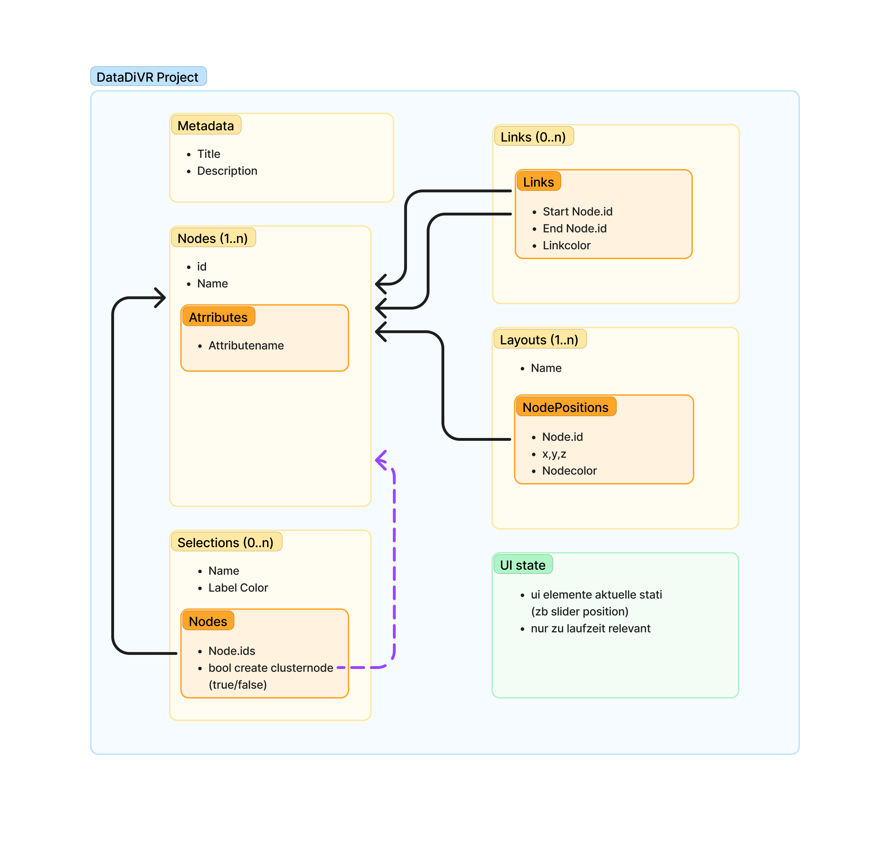

# Project Functionality

## Overview

Functionality for managing a DataDiVR project, including reading and writing project files in both JSON and binary formats.

## Data Structure

## Core Components

### Project

The root model representing a DataDiVR project. Contains all data necessary to represent and visualize a network of nodes, their connections, and various layouts.

**Key Attributes:**

- `name`: Project display name
- `attributes`: Optional key-value pairs for project metadata
- `nodes_data`: Efficient storage for node information (IDs, names, attributes)
- `links_data`: Storage for node connections
- `layouts_data`: Dictionary of layout configurations
- `selections`: Optional list of node selection groups

### Data Storage Classes

#### NodeData

Efficient storage for large node datasets:

- `ids`: Array of node IDs (numpy int32)
- `names`: Parallel array of names
- `attributes`: Sparse dictionary of attributes keyed by node ID

#### LayoutData

Storage for layout positions:

- `node_ids`: Array of node IDs (numpy int32)
- `positions`: Array of 3D positions (numpy float32)
- `colors`: Array of RGBA colors (numpy uint8)

#### LinkData

Storage for node connections:

- `start_ids`: Array of source IDs (numpy int32)
- `end_ids`: Array of target IDs (numpy int32)
- `colors`: Array of RGBA colors (numpy uint8)

### File Formats

The project supports two file formats:

#### JSON Format

- Human-readable format
- Uses optimized orjson serialization
- Suitable for very small projects

#### Binary Format

- Compressed zip file containing:
  - `metadata.json`: Project metadata and non-array data
  - `arrays/*.npy`: Binary numpy arrays for large datasets
- Optimized for large projects with significant numerical data
- Uses numpy's native format for efficient storage of arrays
- much smaller file size than JSON
- faster to load (10x+)

### Color Representation

Colors are represented using RGBA format:

- Type: `RGBAColor = tuple[int, int, int, int]`
- Values: Four integers representing Red, Green, Blue, and Alpha channels

::: datadivr.project.model
options:
show_root_heading: true
heading_level: 2
members: [Project, Node, Link, Layout, LayoutNodePosition, Selection]
show_source: false
